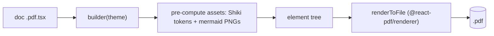

# React document builder

**A React 18 library for authoring documents as hand-written JSX and rendering them to PDF with [`@react-pdf/renderer`](https://react-pdf.org), styled to vanilla [ShadCN](https://ui.shadcn.com) design tokens via [`react-pdf-tailwind`](https://github.com/Kaldarmaa/react-pdf-tailwind), with light/dark chosen at render time.**

Lives in [`builder/`](../../../builder). End-user usage (authoring a doc, running the CLI) is in [`builder/README.md`](../../../builder/README.md); this doc is the architecture and the invariants a future change must respect.

---

## 🌟 Overview (plain-language)

You write a document as a React component tree — a `PdfDoc` root wrapping `Cover`, `Section`, `Callout`, `Table`, `CompareCard`, `CodeBlock`, `Mermaid`, and the rest of a fixed **component library**. `@react-pdf/renderer` lays that tree out into a paginated PDF directly — there is no HTML, no browser page-layout, no print step. The PDF is the only output.

Two ideas carry the whole design:

- **Components reach color through one styling boundary, and it speaks vanilla ShadCN.** Every component calls `useTw()` — a theme-bound class→style resolver — and writes ShadCN semantic Tailwind classes (`bg-card`, `text-foreground`, `border-border`, `rounded-lg`, …). `react-pdf-tailwind`'s `createTw` turns those into the pt-based style objects react-pdf wants. The exact token hexes live once in `theme/palette.ts` as the `SHADCN` map (the canonical slate default, resolved HSL→hex); **`SHADCN` is the sole source of color**. Retuning toward a custom look happens there and nowhere else.
- **Light/dark is a per-render token selection, not a CSS toggle.** react-pdf has no CSS variables and `react-pdf-tailwind` has no `dark:` variant, so a document is rendered twice — once per theme — and `PdfDoc` builds the resolver from `SHADCN.light` or `SHADCN.dark` for that render. Nothing in the PDF toggles; the theme is baked in.

Worked example — rendering the configurator doc to a dark PDF:

```bash
cd builder
node --import tsx src/pdf/cli.ts src/docs/configurator.pdf.tsx --theme dark --out configurator.pdf
```

A PDF doc module default-exports a builder `(theme) => <PdfDoc …>`, so one authored document renders in either theme. The CLI imports the module, awaits the builder (it may be async — see the asset pre-pass below), and hands the element to `renderToFile`.



### Why assets are pre-computed

react-pdf renders **synchronously** and embeds only primitives (`View`, `Text`, `Image`), so anything that needs async work or that react-pdf can't lay out is computed up front, in the doc builder, before the tree is handed to the renderer:

- **Code** — `highlightCode()` runs [Shiki](https://shiki.style) and returns tokenized lines (content + hex per span) plus the theme's bg/fg. `CodeBlock` lays those out as mono `<Text>` runs; the Shiki theme's own colors are kept (they are tuned together for contrast, orthogonal to the ShadCN palette), framed by the ShadCN `Card`.
- **Mermaid** — `rasterizeMermaid()` renders a chart in headless Chrome (themed from `SHADCN[theme]`), screenshots it to a transparent high-DPI PNG, and returns a data URI. `Mermaid` embeds it as an `<Image>`. **Chrome is used only to bake the diagram image — never for page layout.**

## 🛠 Technical reference

### Architecture

| Area | Unit | Responsibility |
|---|---|---|
| Token values | `src/theme/palette.ts` | `SHADCN.light`/`.dark` — the vanilla ShadCN slate tokens as hex, and `ShadcnToken`. The sole source of color. |
| Styling boundary | `src/pdf/theme.ts` | `shadcnConfig(theme)` → the `react-pdf-tailwind` config; `TwProvider`/`useTw()` carry a theme-bound `tw` via context. Also registers fonts, and holds page geometry (`PAGE`, `CONTENT_HEIGHT`). |
| Document root | `src/pdf/components/PdfDoc.tsx` | Builds `createTw(shadcnConfig(theme))` once, provides it via `TwProvider`, and sets the `<Page>` ground/ink to the `background`/`foreground` tokens. |
| Components | `src/pdf/components/*.tsx` | The presentational library (see `builder/README.md` for the full list). Color only through `useTw()`. |
| Render | `src/pdf/renderPdf.ts` | `renderPdfToFile()` — `@react-pdf/renderer`'s `renderToFile`; react-pdf paginates itself, no browser. |
| CLI | `src/pdf/cli.ts` | `generatePdf()` imports a `*.pdf.tsx` builder, awaits it (assets pre-computed), renders; `parsePdfArgs` + CLI entry. |
| Code asset | `src/pdf/highlightCode.ts` | `highlightCode()` → `HighlightedCode` (Shiki tokens + theme bg/fg). Async; run in the doc builder. |
| Diagram asset | `src/pdf/rasterizeMermaid.ts` | `rasterizeMermaid()` → `RasterDiagram` (PNG data URI + aspect). Themes mermaid from `SHADCN[theme]`. Async; needs Chrome. |
| Chrome | `src/pdf/chrome.ts` | `findChrome()` — env → standard install paths → puppeteer's bundled Chromium, or `null`. |

### The styling boundary (`useTw`)

Components never see the engine, the points units, or which theme is active:

```tsx
const tw = useTw();
<View style={tw('bg-card border border-border rounded-lg px-4 py-3')}>
  <Text style={tw('text-sm font-semibold text-foreground')}>{title}</Text>
</View>
```

`PdfDoc` builds the resolver once per render (`useMemo(() => createTw(shadcnConfig(theme)), [theme])`) and provides it; every component calls `useTw()`. Mixed raw style is fine where `react-pdf-tailwind` can't express something (the display/mono font family, exact letter-spacing, a deterministic alignment offset) — components pass an array `[tw('…'), { …raw }]`.

### The `fg-*` class convention (a forced library divergence)

`react-pdf-tailwind` reads the **last** hyphen segment of a class as a shade and does not honour a color's `DEFAULT`. A *string* color resolves the bare utility (`bg-card`) but never `card-foreground`; an *object* color resolves its shades (`text-card-foreground`) but not the bare base. The two are mutually exclusive for one key. So:

- **Base tokens are flat strings** — `bg-card`, `bg-muted`, `bg-primary`, `text-foreground`, `border-border`, … all resolve, vanilla.
- **Surface-foreground tokens live as shades of one `fg` color** — ShadCN's `text-muted-foreground` is written **`text-fg-muted`** here (likewise `text-fg-primary`, `text-fg-secondary`, `text-fg-destructive`). Values are exactly vanilla ShadCN; only the foreground *class spelling* diverges, forced by the library.

This is why the dependency is pinned to **`react-pdf-tailwind@2.3.0`** (Tailwind-v3-based): v3.0.0 is Tailwind-v4-based and rejects `theme.extend.colors` semantic classes (`bg-card` → "Invalid class").

### The role palette (semantic gaps ShadCN lacks)

Vanilla ShadCN ships only `default` and `destructive` as semantic colors. Where a component needs more (callout variants, compare-card columns, flow tones, key-box rules), it fills the gap from a fixed role palette: **negative/caution → `destructive`**, **warning → Tailwind `amber`**, **positive/tip → Tailwind `emerald`**, **note/info → `primary`**. These saturated mid-tones read on both the light and dark ground. Because `react-pdf-tailwind` has no `dark:`, components avoid fixed soft tints (e.g. `emerald-50`) that would glare in dark; filled "soft" surfaces use the theme-swapped `muted` token and carry the role in a border, stroke, or title instead (the Callout Alert and KeyBox do this).

### Per-shape mermaid recolor

`rasterizeMermaid` keys off mermaid's `.label-container` element to give every diagram the same shape→role mapping: `rect` = process (`primary`), `polygon` = decision (amber), `path`/cylinder = data store (emerald), `circle`/`ellipse` = terminal (muted-foreground). Nodes share the theme-swapped `muted` fill and carry their role in the stroke; base vars (edges, text, clusters) come from `SHADCN[theme]`. Because the diagram is rasterized once per theme, it can use the theme's own resolved tokens directly.

### Boundaries & invariants

- **Components never hold a raw color or reach `SHADCN` directly** — only `useTw()` + ShadCN semantic classes. Retuning a hue edits only `theme/palette.ts`; no component changes.
- **`SHADCN` is the single source of color.** There is no other palette, no CSS variables, no `tailwind.config` color extension.
- **Light/dark is resolved per render**, not toggled. A document is rendered once per theme; `PdfDoc` selects the token set. Nothing in the output is theme-reactive.
- **PDF layout never touches a browser.** `@react-pdf/renderer` paginates from the primitive tree. Chrome (`findChrome()`) is needed only to rasterize mermaid diagrams; a doc with no mermaid needs no Chrome.
- **Async work happens in the doc builder, before render.** react-pdf render is synchronous — Shiki highlighting and mermaid rasterization are awaited up front and embedded as data.

## 🚀 Development & testing

```bash
cd builder
npm install            # one-time; puppeteer downloads its own Chromium (for mermaid)
npm test               # vitest — component token + render tests
npm run typecheck      # tsc --noEmit
```

Render and eyeball both themes (rasterize the PDFs to inspect):

```bash
node --import tsx src/pdf/cli.ts src/docs/configurator.pdf.tsx --theme light --out /tmp/c-lt.pdf
node --import tsx src/pdf/cli.ts src/docs/configurator.pdf.tsx --theme dark  --out /tmp/c-dk.pdf
pdftoppm -png -r 110 /tmp/c-lt.pdf /tmp/lt   # needs poppler
```

`src/docs/configurator.pdf.tsx` exercises every component (including four mermaid diagrams) and is the fixture the render checks run against.
