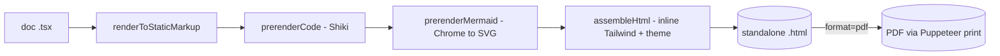

# React document builder

**A React 18 + native-Tailwind library for authoring documents as hand-written JSX and rendering them to a standalone HTML file and to PDF — one HTML source of truth, printed to PDF by headless Chrome, with light/dark chosen at generation time and no runtime JS in the output.**

Lives in [`builder/`](../../../builder). End-user usage (authoring a doc, running the CLI) is in [`builder/README.md`](../../../builder/README.md); this doc is the architecture and the invariants a future change must respect.

---

## 🌟 Overview (plain-language)

You write a document as a React component tree — a `Doc` root wrapping `Cover`, `Section`, `Callout`, `Table`, `CompareCard`, `CodeBlock`, `Mermaid`, and the rest of a fixed **component library**. The builder renders that tree to a single HTML file, and — when you ask for PDF — prints that same HTML with headless Chrome. The HTML is the **source of truth**; the PDF is never a separate render, only a print of the HTML, so the two always agree.

Two ideas carry the whole design:

- **The token module is the only way components reach color.** Every component colors itself through `t.bg.*` / `t.text.* `/ `t.border.*` / `t.font.*` — strings like `bg-[var(--surface)]` that are *native* Tailwind arbitrary utilities reading a CSS variable. The exact hex lives once in `theme/palette.ts`, emitted as `:root` (light) and `[data-theme=dark]` (dark) custom properties. Baking `data-theme` on `<html>` at generation time picks the palette; nothing in the output toggles it. This is why there is **no `tailwind.config` customization** — the config carries only its `content` glob.
- **Everything dynamic is pre-rendered, so the output runs no JavaScript.** Code blocks are highlighted by **Shiki** and mermaid diagrams are rendered to inline **SVG** (and recolored by shape) at *generation* time, not in the browser that opens the file. A `CodeBlock` or `Mermaid` component emits only a marker `<div>`; a generation **pass** finds that marker and swaps in the finished HTML.

Worked example — generating the demo to a dark PDF:

```bash
cd builder
node --import tsx src/generate/cli.ts src/docs/demo.tsx --theme dark --format pdf --out demo.pdf
```

`generate()` renders `demo.tsx` to static markup, runs the pre-render passes (Shiki, then mermaid via the shared Chrome), inlines the built Tailwind CSS into the HTML skeleton, writes the HTML to a temp file, and prints it to `demo.pdf`. For `--format html` the same HTML is written directly to `--out` and no browser is touched.



## 🛠 Technical reference

### Architecture

| Area | Unit | Responsibility |
|---|---|---|
| Theme values | `src/theme/palette.ts` | Single source of exact hex (`PALETTE.light`/`.dark`), `FONTS`, `TokenName`. Nothing else holds a color. |
| Theme surface | `src/theme/tokens.ts` | `t.bg/text/border/font` (arbitrary-utility strings), `cx()` join, `cssVar()` escape hatch (inline/SVG), `themeStyleBlock()` (`:root` + `[data-theme=dark]` + body font). |
| HTML skeleton | `src/generate/html.ts` | `assembleHtml()` wraps body markup into one `<!doctype html>` doc (theme, fonts `<link>`, theme block, inlined Tailwind). Defines the `Pass` / `PassCtx` contract. |
| Orchestrator | `src/generate/cli.ts` | `generate()` composes the pass list uniformly via `reduce`; CLI entry + `parseArgs`. `pdf` branch fails loudly when no Chrome. |
| Tailwind build | `src/generate/tailwind.ts` | `buildTailwindCss()` shells the Tailwind CLI (scans the `content` glob), returns the CSS to inline. |
| Chrome | `src/generate/chrome.ts` | `findChrome()` — env → standard install paths → puppeteer's bundled Chromium, or `null`. |
| PDF | `src/generate/pdf.ts` | `renderPdf()` — Puppeteer print with the fixed `page.pdf` settings; render-gate = `networkidle0` + `document.fonts.ready`. |
| Code pass | `src/generate/prerenderCode.ts` | `prerenderCode: Pass` — replaces each `<div data-code>` with Shiki HTML. Browserless. |
| Diagram pass | `src/generate/prerenderMermaid.ts` | `prerenderMermaid: Pass` — renders each `<div data-mermaid>` to SVG in the shared Chrome and recolors nodes by shape. |
| Shared util | `src/generate/htmlEntities.ts` | `unescapeHtml()` — undoes React's text escaping before a pass hands source to Shiki/mermaid. |
| Components | `src/components/*.tsx` | The presentational library (see `builder/README.md` for the full list). Color only through `t.*`. |

### The pass contract

A **pre-render pass** is the uniform seam every marker-replacement shares:

```ts
type PassCtx = { chrome: string | null };
type Pass = (bodyHtml: string, theme: 'light' | 'dark', ctx: PassCtx) => Promise<string>;
```

Each pass owns its own marker loop internally; the generator only composes a list (`[prerenderCode, prerenderMermaid]`) and never contains a pass's find-and-replace logic. To add a generation-time transform, write a `Pass` and append it to that list — nothing else changes.

### Per-shape mermaid recolor

`prerenderMermaid` keys off mermaid's `.label-container` element to give every diagram the same shape→role mapping: `rect` = process (accent), `polygon` = decision (warning), `path`/cylinder = data store (positive), `circle`/`ellipse` = terminal (neutral); edges/arrows stay neutral. Fills use the **soft** role tint with a saturated stroke and dark-ink labels, so one node-text color stays legible across every shape (the terminal's neutral fill can't share a legible text color with a saturated one). Colors come from `PALETTE[theme]`.

### Boundaries & invariants

- **Components never hold a raw color, var name, or arbitrary-utility syntax** — only `t.*` (and `cssVar()` where a class can't reach, e.g. an inline SVG fill). Retuning a hue or renaming a var edits only `theme/`; no component changes.
- **No `tailwind.config` customization** — `theme:{}`, `plugins:[]`, `content` glob only. The palette is CSS variables, not a Tailwind color extension.
- **The output carries no runtime JS.** No `<script>`, no event handlers. `prerenderMermaid` initializes mermaid with `securityLevel: 'antiscript'` so a chart can't inject one.
- **PDF requires Chrome; HTML does not.** `generate()`'s `pdf` branch throws an actionable error when `findChrome()` is null rather than dereferencing it. `findChrome()` resolving Chrome is also what the mermaid pass needs — so it is resolved for both formats (a diagram must render whichever format is asked).
- **The HTML is self-contained but for fonts.** Tailwind CSS, code, and diagrams are inlined; the only network dependency is the Google Fonts `<link>`.

## 🚀 Development & testing

```bash
cd builder
npm install            # one-time; puppeteer downloads its own Chromium
npm test               # vitest — component render + generation + pass tests
npm run typecheck      # tsc --noEmit
```

Generate and eyeball all four outputs (rasterize the PDFs to inspect):

```bash
node --import tsx src/generate/cli.ts src/docs/demo.tsx --theme light --format pdf --out /tmp/d-lt.pdf
node --import tsx src/generate/cli.ts src/docs/demo.tsx --theme dark  --format pdf --out /tmp/d-dk.pdf
pdftoppm -png -r 110 /tmp/d-lt.pdf /tmp/lt   # needs poppler
```

`src/docs/demo.tsx` exercises every component and is the fixture the generation tests and the visual parity check run against.
