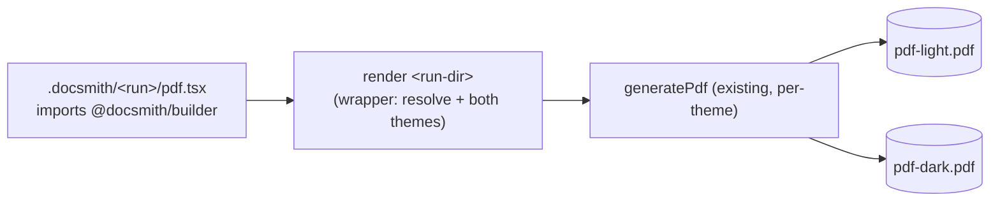

# docsmith:builder skill — spec

**Date:** 2026-09-14
**Author:** @andyleach
**Status:** Approved
**Origin:** signal (discovery)

## 0. ELI5

The docsmith plugin offers one skill, and that skill still drives an old, retired way of making
PDFs (turn Markdown into a web page, then print it). The project has since built a much nicer
engine — the **builder** — where you write a document as React code and it renders straight to a
polished PDF in light or dark. But there's no skill that points an agent at the new engine, so
asking docsmith for a PDF still leads to the dead path.

We're going to delete the old skill, move the builder into a new skill called **`docsmith:builder`**,
and write instructions that teach an agent to: make a fresh working folder, write the document as
React, run one command, and look at the two PDFs that come out. We'll also fix every file that still
mentions the old skill or the builder's old location, so the whole repo tells one consistent story.

We'll know it worked when the new skill exists, the builder's own tests still pass from its new home,
one command turns an authored document into a light and a dark PDF inside a `.docsmith/<run>/` folder,
and searching the repo finds no leftover pointers to the old skill or the old path.

## 1. Problem

The `docsmith` plugin ships exactly one skill — `rendering-markdown-to-pdf` — and it drives the
**retired** rendering path: a bundled Node script (`skills/rendering-markdown-to-pdf/scripts/md2pdf.mjs`)
that turns Markdown into PDF through headless Chrome + marked + mermaid. That HTML pipeline was
superseded by the React document **builder** (`builder/`, `@docsmith/builder`) — hand-authored JSX
rendered to PDF via `@react-pdf/renderer`, styled to ShadCN tokens — but the builder has **no skill
entry point**. An agent invoking docsmith is still pointed at the dead pipeline. Now, because the
builder is the project's actual rendering path and the skill is the only thing the plugin surfaces.

## 2. Users & stakeholders

- **Primary consumer:** Claude / coding agents that invoke `docsmith:builder` to produce a designed
  PDF. The skill is agent-facing instructions, not an end-user CLI.
- **Secondary:** humans reading the plugin/README to understand what docsmith does.
- **Decides / signs off:** @andyleach (the suite maintainer).

*(Provenance: derived from established repo facts — a skill inside the maintainer's own plugin,
consumed by agents — flagged in the brief as the softest ground.)*

## 3. Goals & success criteria

| Criterion | How it's checked |
|---|---|
| New skill exists as `docsmith:builder` | `skills/builder/SKILL.md` present with `name: builder`; frontmatter describes the author-JSX→PDF flow |
| Legacy skill gone | `skills/rendering-markdown-to-pdf/` no longer exists |
| Builder owned by the skill, still healthy | `cd skills/builder && npm test` and `npm run typecheck` both green from the new location |
| Authored doc renders both themes into a run dir | Scaffold `.docsmith/<date-slug>/pdf.tsx`, run the wrapper `render <run-dir>`; `<run-dir>/pdf-light.pdf` and `<run-dir>/pdf-dark.pdf` are produced and visually inspected (not judged by exit code alone) |
| Authored doc imports the stable specifier | `<run-dir>/pdf.tsx` imports from `@docsmith/builder` (no relative/absolute path into the package) and resolves under the wrapper |
| Repo left consistent | `git grep` finds no `rendering-markdown-to-pdf` and no reference to the old root `builder/` path outside history; `README.md`, `plugin.json`, `marketplace.json`, feature doc all describe/point at the builder in its new home |
| SKILL.md teaches the workflow | SKILL.md walks scaffold → author `pdf.tsx` → `render` → inspect → iterate |

## 4. Constraints

- **Skill name / discovery:** folder `skills/builder/`, `name: builder` in SKILL.md frontmatter →
  surfaced as `docsmith:builder`. Discovery is directory-based (`skills/<name>/SKILL.md`); nothing
  enumerates skills in `plugin.json`.
- **Placement:** the builder package is **moved** into `skills/builder/` and sits at the skill root
  (SKILL.md alongside `package.json`/`src`/`test`/`assets`/`README.md`). Not referenced in place,
  not duplicated.
- **Input model:** author JSX from a source doc using the builder's component library. No
  Markdown→PDF path and no MD→JSX converter — retired with the legacy skill.
- **Run dir:** `.docsmith/<run>/` at the **invoking project's root** (mirrors `.engineering/`);
  `<run>` = date+slug (e.g. `2026-09-14-api-guide`), timestamped so renders keep history. Files:
  `pdf.tsx`, `pdf-light.pdf`, `pdf-dark.pdf`.
- **Location-independence:** everything must work whether the skill runs from this repo
  (`skills/builder/`) or from the plugin cache (`~/.claude/plugins/cache/.../skills/builder/`).
- **Stack (inherited, unchanged):** Node ≥ 18; `@react-pdf/renderer`; `react-pdf-tailwind@2.3.0`
  (pinned — v3 breaks semantic classes); Shiki; mermaid via headless Chrome only for diagram
  rasterization; bundled Inter + IBM Plex Mono fonts.

## 5. Scope

**In:**
- Delete `skills/rendering-markdown-to-pdf/` entirely.
- `git mv builder/* skills/builder/`; package sits at the skill root.
- Add `exports: { ".": "./src/pdf/index.ts" }` to the package `package.json`.
- Add the `render <run-dir>` wrapper (renders both themes into the run dir; bridges bare-specifier
  resolution). Reuse the existing `generatePdf`; leave the per-theme `cli.ts` untouched.
- Write `skills/builder/SKILL.md` (author-JSX-from-a-doc workflow) and `skills/builder/references/`
  (component catalog + when-to-use matrix + verification protocol). Keep the moved `README.md` as
  the package reference.
- Fix all breaking references: rewrite root `README.md`; update `.claude-plugin/plugin.json` +
  `marketplace.json` framing to builder/react-pdf/ShadCN; fix
  `docs/document-rendering/react-doc-builder/README.md` paths (`../../../builder` →
  `../../../skills/builder`) and the package README's `../docs` → `../../docs`; drop the stale
  `skills/*/scripts/vendor` rules from root `.gitignore` and add `.docsmith/`.
- Verify per §3.

**Out (non-goals):**
- **Markdown→PDF / MD→JSX converter** — the author-JSX model was chosen; preserving zero-authoring
  would mean building a converter that does not exist.
- **New builder components or restyle** — this run relocates and documents the builder; it does not
  extend it. Keeps the change reviewable.
- **Changing the per-theme CLI invocation** — the `exports` field and `render` wrapper are additive;
  `generatePdf`/`cli.ts` behavior is unchanged.

**Deferred:**

| Item | Trigger to revive |
|---|---|
| Salvage the retired skill's "when to use each" decision matrix as a first-class reference | If the new `references/` matrix proves too thin in use |
| A `docsmith new <slug>` scaffolder verb (stamp the dated run dir + a starter `pdf.tsx`) | If agents repeatedly get run-dir naming or the import boilerplate wrong |

## 6. Approach (from the design dialogue)

**Chosen approach:** delete the legacy skill, move the builder package into `skills/builder/` (package
at the skill root), teach the author-JSX-from-a-doc workflow in a new `SKILL.md`, and repair every
reference so the repo is consistent. One pass, no increments — the change lands cleanly in a single
slice.

Alternatives weighed and rejected:
- **Reference the in-repo builder in place** (skill = instructions only, pointing at repo-root
  `builder/`). Rejected: the skill must be portable as a plugin; pointing at a sibling repo path
  that does not exist in the plugin cache breaks outside this repo. The maintainer chose *move*.
- **Vendor a copy of the builder into the skill.** Rejected: two copies to keep in sync.
- **Nest the package under a subdir** (`skills/builder/pkg/`). Rejected: a redundant nesting level
  and longer paths everywhere for no gain; package-at-root keeps internal imports and tests
  unchanged.
- **A Markdown→builder path** preserving zero-authoring. Rejected: needs an MD→JSX converter that
  does not exist; out of scope.

**Boundary shaped — the authored-doc ↔ `@docsmith/builder` seam** (via `using-codebase-design`).
The load-bearing decision is how a doc authored *outside* the package (in the project's
`.docsmith/<run>/`) reaches the builder, given the package may live in the plugin cache. Shape
chosen — a **plain facade**, deep-not-shallow:

- **(a) Import specifier — the commitment:** the authored `pdf.tsx` imports the **bare
  `@docsmith/builder`** (the public barrel), never the package's physical path. The package declares
  `exports: { ".": "./src/pdf/index.ts" }` to make that specifier legitimate. A caller (the agent)
  learns one stable name.
- **(b) Wrapper command — the commitment:** one verb, `render <run-dir>`, renders `<run-dir>/pdf.tsx`
  to `<run-dir>/pdf-light.pdf` + `<run-dir>/pdf-dark.pdf` (both themes by default), reusing
  `generatePdf`, and owns the resolution bridging from its own known location. The agent learns one
  command; the wrapper decides *how* (both themes, path resolution, output naming). The exact
  resolution mechanism (symlink / `NODE_PATH` / resolve hook) and the wrapper's typed signature are
  the plan's to pin — §6 records that the seam is a facade hiding the package location, not its code.

Rejected boundary alternative: **bake the package's absolute path into `pdf.tsx`** at scaffold time.
Rejected because it leaks the package's physical location into every authored file — a plugin
version bump changes the cache path and every kept `pdf.tsx` breaks (change-inside-forces-change-
outside). The bare-specifier + wrapper shape hides the location behind the one place that recomputes
it each run.

## 7. Existing context

- **Legacy skill** `skills/rendering-markdown-to-pdf/` — SKILL.md + `references/` (ui-elements,
  gallery, troubleshooting) + bundled `scripts/md2pdf.mjs` (+ node_modules, vendor). The retired
  HTML/puppeteer pipeline.
- **Builder** `builder/` (`@docsmith/builder`, `type: module`, `private`, **no `exports` field**):
  - `src/pdf/cli.ts` — `generatePdf({docModule, theme, out})` dynamic-imports a `*.pdf.tsx` builder by
    absolute file URL (`pathToFileURL(resolve(docModule))`), awaits it, renders; `parsePdfArgs`
    validates `--theme light|dark` + `--out`.
  - `src/pdf/index.ts` — the public barrel (all components + `highlightCode`/`rasterizeMermaid` +
    `PdfTheme`) — the target of the new `exports`.
  - `src/pdf/renderPdf.ts`, `theme.ts`, `chrome.ts`, `highlightCode.ts`, `rasterizeMermaid.ts`,
    `components/*.tsx`, `src/theme/palette.ts`, `src/docs/{proof,configurator}.pdf.tsx`,
    `assets/fonts/`, `test/`.
  - `tsconfig.json` — `moduleResolution: Bundler`, no `paths`. Rendered with `tsx`.
- **Reference sites that break on the move** (mapped): root `README.md` (whole quickstart is the
  md2pdf script); `.claude-plugin/plugin.json` + `marketplace.json` (descriptions/keywords say
  "Markdown→PDF via puppeteer"); `docs/document-rendering/react-doc-builder/README.md` (`../../../builder`
  paths, line 5 + 52); the package's own `README.md` (`../docs/...` link, line 14); root `.gitignore`
  (`skills/*/scripts/vendor/*` rules).
- **Docs consulted during design:** `docs/toc.md` (feature index) and
  `docs/document-rendering/react-doc-builder/README.md` (the builder's architecture + invariants) —
  both load-bearing; the toc row and the feature-doc paths are among the references being repaired.
- Note: `.claude/worktrees/shadcn-pdf-components/` is a separate git worktree — out of scope.

## 8. Open questions

- **Resolution mechanism for the bare specifier** — symlink (`.docsmith/node_modules/@docsmith/builder`),
  `NODE_PATH`, or a Node resolve hook. Does not block starting; the plan picks one against the
  location-independence constraint (must work from the plugin cache too).
- **Depth of `references/`** — how much of a component when-to-use matrix the SKILL needs before it's
  "enough." Parked in §5 Deferred; start lean, expand if thin in use.
