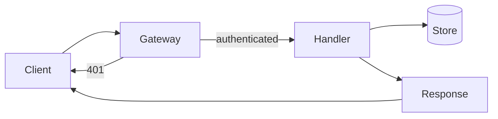

# Request Lifecycle

A request moves through a small, fixed pipeline before a response goes back to the client.
Each stage either passes the request forward or short-circuits with an error.

## The pipeline

The gateway authenticates first, then routes to a handler, which reads or writes the store
and returns a result the gateway serializes.

## Notes

The gateway is the only component that talks to the client; handlers never do. A `401` is
returned by the gateway before a handler is ever reached.
