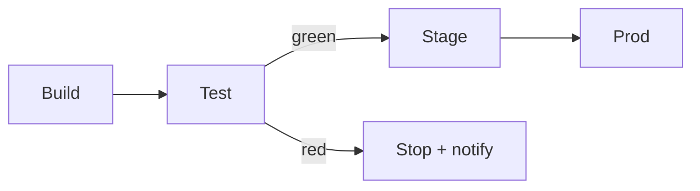

# Deploy Pipeline

Shipping a change runs through four gated stages. A failure at any gate stops the release and
notifies the on-call engineer; nothing advances past a red gate.

## Stages

Build compiles and packages the artifact. Test runs the suite against it. Stage deploys to a
pre-production environment for smoke checks. Prod promotes the same artifact to production.

## Rollback

Prod keeps the previous artifact hot for one hour after a promotion, so a bad release rolls
back by re-pointing the load balancer rather than rebuilding — a rollback is seconds, not
minutes.
