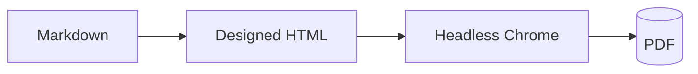

## Callouts & badges

<!-- eyebrow: Inline elements -->
Badges: [[New]] [[accent:Accent]] [[positive:Stable]] [[warning:Beta]] [[negative:Deprecated]].

> [!NOTE]
> A note in the accent role.

> [!TIP]
> A tip in the positive role.

> [!WARNING]
> A warning in the amber role.

> [!CAUTION]
> A caution in the negative role.

## Key boxes & legend

  

Gap 1 — no results

Tool output is absent end to end.

  

Gap 2 — no markdown

Prose renders as plain text.

  accent
  positive
  negative
  warning

<!-- eyebrow: Category by category -->
## Reference cards
<!-- deck: A two-column table becomes a grid of cards — neutral header band, accent title, and clean namespace wrapping, styled like the artifact's cards. -->

| Class | Responsibility |
|---|---|
| `Docsmith\Render\MarkdownDocumentRenderer` | The only class allowed to drive the headless browser. Parses the Markdown, runs mermaid, prints the PDF. |
| `Docsmith\Theme\DesignedThemeStylesheetProviderInterface` | A deliberately long name to prove the header wraps cleanly at the namespace separator instead of running off the card edge. |
| `Docsmith\Diagram\DiagramCardBuilder` | Turns a mermaid fence plus its figure/caption directives into a titled card. |

## Comparison

  
01<h3>Questions &amp; permissions</h3>

  

    

Today

      <ul><li>Vanishes after answering.</li><li>Answers flattened to a string.</li></ul>

    

Target

      <ul><li>Inline card with previews.</li><li>Structured, persisted answers.</li></ul>

  

  
<b>Target</b>Inline card, previews, structured answers, full scopes.

## Panels & flow

  
<h3>Data flow</h3>
Parser → correlate by id → store → render.

  
<h3>Library picks</h3>
marked, mermaid, puppeteer-core.

  
today
    
parser→drops results→raw JSON

  
target
    
parser + result→router→presenter

## Phases

  

0

<h3>Foundations</h3>
Result capture end to end; unified row + router.

  

1

<h3>Tool-row system</h3>
Pure presenter, collapsed rows, result view.

  

7

<h3>Discovery parallelizable</h3>
Independent of the render work; can start immediately.

## Diagram

<!-- figure: Render Pipeline | Markdown becomes a styled page, then Chrome prints it. -->

## Open questions & non-goals

<ul class="qlist"><li>DB migration vs rebuild for the new column?</li><li>Truncation policy for large output?</li></ul>

<ul class="xlist"><li><b>Other-agent support</b> — out of scope this run.</li><li><b>Non-chat panes</b> — not part of this work.</li></ul>

  Generated from the approved spec. 
  spec · .engineering/2026-09-09-run/spec.md 
  reference · github.com/dashworthy/docsmith

